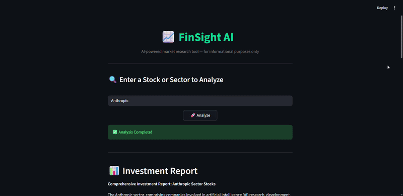

# 📈 FinSight AI

An intelligent multi-agent stock and sector analysis tool powered by AI. FinSight AI uses a pipeline of 6 specialized AI agents to fetch real-time news, analyze market sentiment, retrieve stock data, and generate comprehensive investment research reports.

> ⚠️ This tool is for research and informational purposes only. It does not constitute financial advice. The user bears full responsibility for any investment decisions made using this tool.

---

## 🚀 Features

- 🔍 Analyze any **stock ticker** (e.g. AAPL, TSLA) or **sector** (e.g. Oil & Gas, Technology)
- 🤖 **6 specialized AI agents** working in a sequential pipeline
- 📰 Real-time news fetching via **NewsAPI**
- 📊 Live stock data via **yFinance**
- 🧠 Sentiment analysis on latest news articles
- 📝 Clean, structured investment research report with Buy/Hold/Sell recommendations
- ⚡ Powered by **Groq (LLaMA 3.3 70B)** for fast inference

---

## 🧠 Agent Pipeline
```
User Input (Stock/Sector)
        ↓
1. Sector Mapper      → Identifies top 4-5 stock tickers
        ↓
2. News Fetcher       → Fetches latest 5 news articles per stock
        ↓
3. Sentiment Analyst  → Scores news as positive/negative/neutral
        ↓
4. Stock Analyst      → Fetches price trends, volume, current price
        ↓
5. Synthesizer        → Combines sentiment + stock data into insights
        ↓
6. Report Writer      → Generates final investment research report
```

---

## 🛠️ Tech Stack

- **CrewAI** — Multi-agent orchestration
- **Groq (LLaMA 3.3 70B)** — LLM backbone
- **yFinance** — Stock price data
- **NewsAPI** — Real-time news
- **Streamlit** — Web UI
- **Python** — Core language

---

## ⚙️ Setup & Installation

### 1. Clone the repository
```bash
git clone https://github.com/aniruddh-aidev/FinSight-AI.git
cd FinSight-AI
```

### 2. Create virtual environment
```bash
python -m venv finsight-env
source finsight-env/bin/activate  # Mac/Linux
finsight-env\Scripts\activate     # Windows
```

### 3. Install dependencies
```bash
pip install -r requirements.txt
```

### 4. Set up API keys
Create a `.env` file in the root folder:
```
GROQ_API_KEY=your_groq_api_key
NEWS_API_KEY=your_newsapi_key
```

Get your free API keys:
- Groq: https://console.groq.com
- NewsAPI: https://newsapi.org

### 5. Run the app
```bash
streamlit run app.py
```

---

## 📸 Demo



---

## 👨‍💻 Author

**Aniruddh** —  AIML Student
- GitHub: [@aniruddh-aidev](https://github.com/aniruddh-aidev)

---

## 📄 License

MIT License — feel free to use and modify!
